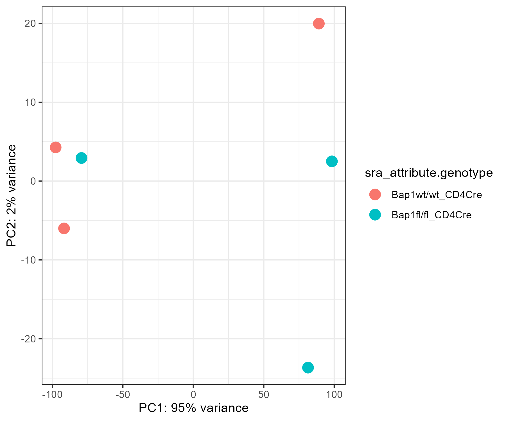
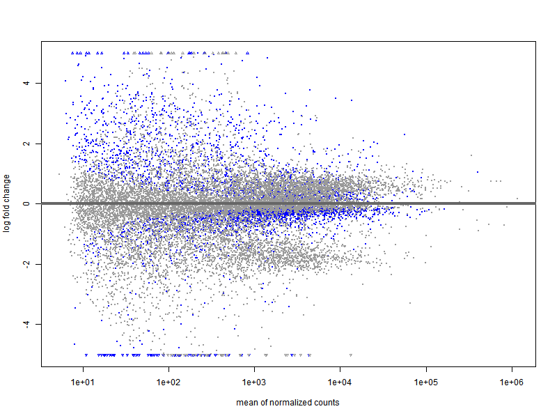
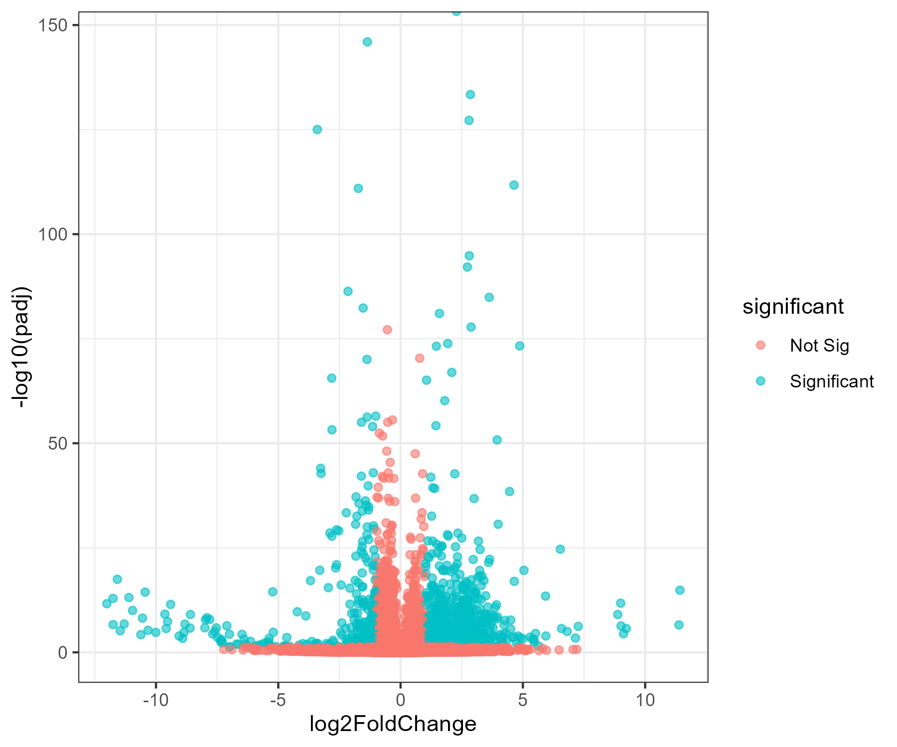
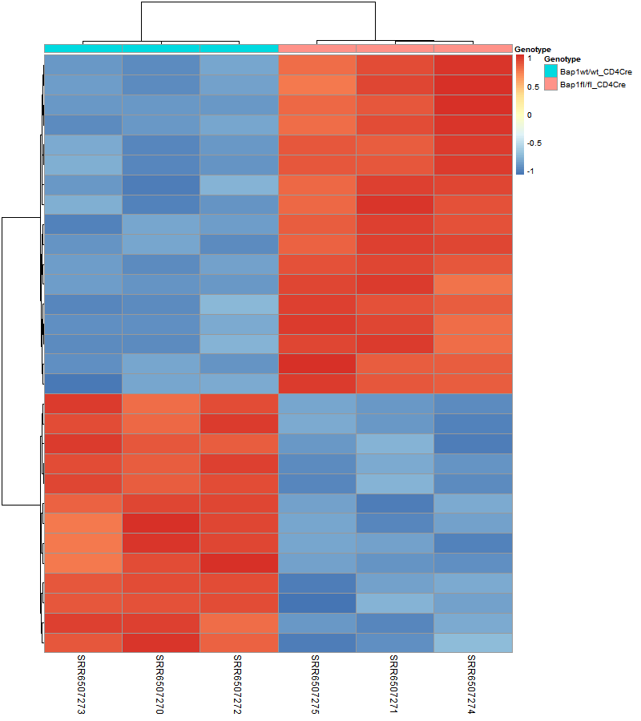

# Differential Expression Analysis in Mouse

## Introduction

In this work, a differential expression analysis was performed using RNA-seq data from a murine model. The objective was to identify differentially expressed genes between the selected experimental conditions and to understand the associated biological changes.

## Dataset Selection

The project SRP131263 was selected because it contains approximately 30 samples. This provides sufficient replication to obtain statistically robust results without making the analysis unnecessarily complex.

The dataset was selected based on:

- Sufficient number of samples  
- Good balance between conditions  
- Publicly available and properly annotated data  

## Data Preparation

First, the data were loaded using R tools designed for transcriptomic data handling. The following steps were then performed:

- Inspection of the count matrix  
- Verification of sample metadata  
- Filtering of low-expression genes  
- Data normalization  

These steps were necessary to ensure valid comparisons between conditions and to reduce potential technical biases.

## Differential Expression Analysis

An appropriate statistical model for count data was applied. The analysis allowed the estimation of:

- Expression changes (log2 Fold Change)  
- Adjusted statistical significance  
- Upregulated and downregulated genes  

A significance threshold based on adjusted p-values was used to control for multiple testing.

## Main Results

The analysis identified a set of differentially expressed genes between the evaluated conditions.

The results showed:

- Significantly upregulated genes  
- Significantly downregulated genes  
- Consistency across biological replicates  

These findings suggest biological changes associated with the experimental condition under study.

## Workflow

The analysis was organized into three main stages, each implemented in an independent script to maintain clarity and methodological order.

### 1. Data Retrieval and Initial Preparation

In the first script, the recount3 library was used to explore available mouse projects and select project SRP131263. The selection was based on the number of samples and its suitability for differential expression analysis.

The dataset was downloaded and a RangedSummarizedExperiment object was constructed, containing both the count matrix and annotation information. Gene-level read counts were computed, and SRA attributes were expanded to incorporate relevant metadata into the object.

Finally, two versions of the object were saved: a raw version and a processed version. This ensures traceability between the original downloaded data and the data prepared for downstream analysis.

### 2. Quality Control and Differential Expression Analysis

In the second script, the processed object was loaded and quality assessment was performed. The proportion of reads assigned to genes was calculated to verify that no extreme outliers or evident quality issues were present.

Metadata were then explored to evaluate the distribution of genotypes and cell types. Based on this exploration, the analysis was restricted to a single cell type (Act_CD4) in order to avoid potential confounding effects derived from different Cre systems.

The dataset was filtered by removing low-expression genes, requiring a minimum count threshold in at least three samples. This reduces statistical noise and improves model stability.

A DESeq2 object was then constructed, defining the experimental design based on genotype. The wild-type genotype was set as the reference level to ensure biologically coherent interpretation of expression changes.

The DESeq2 statistical model was executed to estimate differential expression. The resulting output included log2 Fold Changes and adjusted p-values. Both the model object and the results were saved for downstream visualization and interpretation.

### 3. Visualization and Interpretation of Results

In the third script, the model outputs were loaded and a variance stabilizing transformation was applied to facilitate visualization of global expression patterns.

Several key plots were generated:

- Principal Component Analysis (PCA) to assess separation between genotypes  
- MA plot to visualize expression changes relative to mean expression  
- Volcano plot to identify significantly differentially expressed genes based on combined statistical and fold change thresholds  
- Heatmap of the top 30 most significantly differentially expressed genes, using gene-wise scaled expression values to highlight relative patterns across samples  

All figures were exported as independent files to visually document the results of the analysis.

The complete workflow follows a modular structure that clearly separates data acquisition, statistical modeling, and visualization. This organization enhances reproducibility, biological interpretability, and flexibility for modifying individual stages without affecting the overall analysis.

### Principal Component Analysis (PCA)

The PCA plot shows a clear separation between genotypes along PC1, which explains 95% of the total variance. This indicates that genotype is the main source of variation in the dataset. Samples cluster tightly within each group, suggesting good reproducibility among biological replicates.

PC2 explains only 2% of the variance and does not contribute substantially to group separation, further supporting that the primary transcriptional differences are driven by genotype rather than technical variability or noise.

Overall, the strong separation along PC1 indicates a robust and consistent transcriptional effect associated with the Bap1 genotype.

### MA Plot

The MA plot displays the log2 fold change as a function of mean normalized expression. Most genes cluster around log2 fold change values near zero, indicating that the majority of genes are not differentially expressed between genotypes.

However, a distinct subset of genes shows substantial positive or negative fold changes, particularly at moderate expression levels. The distribution appears symmetric, suggesting both upregulation and downregulation events.

The spread of points is wider at lower expression levels, which is expected due to increased variance in low-count genes. At higher expression levels, fold changes appear more stable, reflecting improved statistical confidence in well-expressed genes.

### Volcano Plot

The volcano plot integrates both statistical significance and magnitude of change. Genes meeting the significance threshold (adjusted p-value < 0.05 and |log2FC| > 1) are clearly separated from non-significant genes.

A considerable number of genes surpass both thresholds, indicating a strong transcriptional response associated with genotype. Significant genes are distributed on both sides of the plot, demonstrating the presence of both upregulated and downregulated genes.

The clear vertical and horizontal separation suggests that the identified differentially expressed genes are not only statistically significant but also biologically meaningful in magnitude.

### Heatmap of Top 30 Differentially Expressed Genes

The heatmap of the top 30 most significantly differentially expressed genes shows clear clustering of samples according to genotype. Samples group into two distinct clusters, corresponding to wild-type and mutant conditions.

Gene expression patterns display strong contrast between groups, with consistent upregulation in one genotype and downregulation in the other. The consistency across biological replicates indicates high reproducibility of the transcriptional differences.

The hierarchical clustering dendrogram further confirms that genotype is the dominant factor structuring the data. These results reinforce the findings observed in the PCA and volcano plots, demonstrating robust and coordinated gene expression changes associated with Bap1 status.

## Conclusions

The analysis successfully identified differentially expressed genes in a statistically robust manner. The structured workflow ensures that the results obtained are reliable and biologically interpretable.